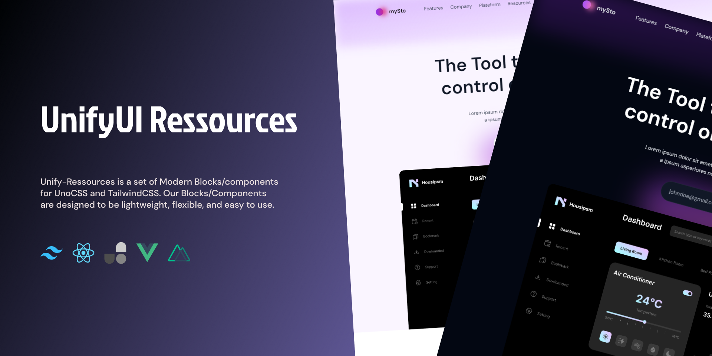

# Unify-Ressources

Unify-Ressources is a set of Modern Blocks/components for UnoCSS and TailwindCSS. Our Blocks/Components are designed to be lightweight, flexible, and easy to use.

## What Come Next

### For UnoCSS

- VueJs/NuxtJs support
- AstroJs support

### For TailwindCSS

1. ReactJS/NextJS Support
2. VueJS/NuxtJs Support
3. AlpineJs support

## Your new Friend
- Easy to use
- Dark mode Support
- Easy to costumize
- Extensible components
- Save time by not having to write your own CSS
- Improve performance by using lightweight and efficient components

## Contributing

If you're interrested in contributing to this project, read this first :

### For UnoCss
Read our [contributing docs](https://github.com/unify-ressources/unify-unocss/blob/main/CONTRIBUTING.md) before submitting a pull request.

### For TailwindCss
Read our [contributing docs](https://github.com/unify-ressources/unify-tailwindcss/blob/main/CONTRIBUTING.md) before submitting a pull request.

Follow us so you don't miss anything 

